# Green IT - Tesla

## Optimization

### Fonts

Converted fonts to WOFF2 format with an English character set.

Size: 169kb -> 13kb

Use font swap.

### Images

Images converted to AVIF and WebP or MozJPEG format.

Images are lazy loaded.

Responsive images with multiple breakpoints.

### Favicon

Default to an SVG favicon, then fallback to PNG.
Add a fake favicon.ico to avoid 404 errors.

### Hosting

Deployed to Vercel, hard cached behind Cloudflare.

Serverless function = zero energy consumption while cached.

Serverless function located in the US in case of cache bust, because that's the main market of Tesla.

Compression GZIP/Brotli enabled.

### Framework

SvelteKit with no client side rendering.
No JS shipped to the client.
Total of 600bytes of JavaScript for text animations and image transitions

### Video

Video converted to AV1 and VP9 format. Disabled autoplay.

- Original MP4 (h264) -> 24mb
- Converted to AV1 -> 4.2mb
- Converted to VP9 -> 6mb

### Accessibility

Use of semantic HTML tags.

Alt tags added to images.

### SEO

Add OG and Twitter tags.

Site map generated.

Robots.txt generated.

### Performance

CSS and JavaScript code inlined in the HTML to reduce requests.

Tailwind classes are sorted by specificity to reduce the size of the CSS once compressed.

## Score

### Google Lighthouse

[Resultat LightHouse](https://pagespeed.web.dev/analysis/https-tesla-birdi-ng/vjt4de451h?form_factor=mobile)

Score LightHouse:
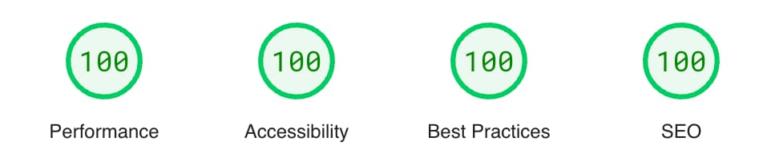

Detail LightHouse Mobile:
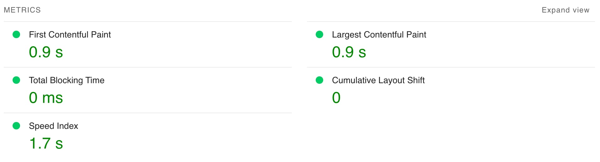

Detail LightHouse Desktop:
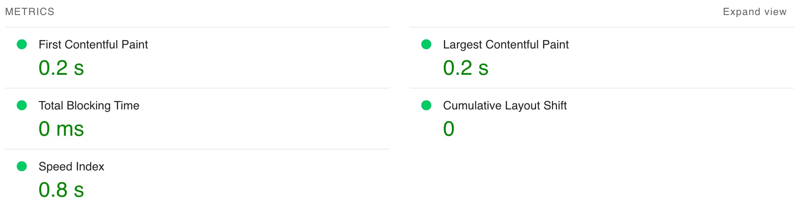

### LightHouse Site de Tesla

Score LightHouse:
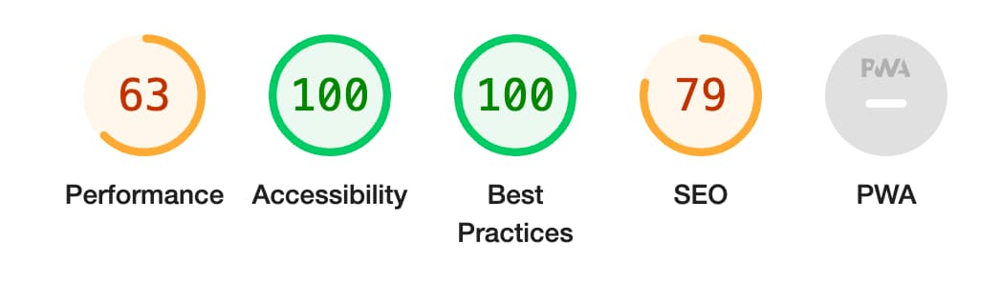

Detail LightHouse Mobile:
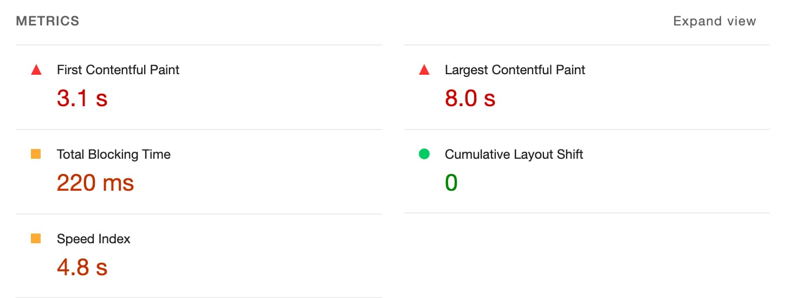

Detail LightHouse Desktop:
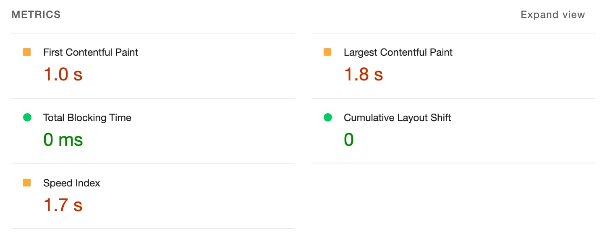

### EcoIndex

[Resultat EcoIndex](https://www.ecoindex.fr/resultat/?id=d7e45269-2189-4324-8eaf-70bce2cbd42c)

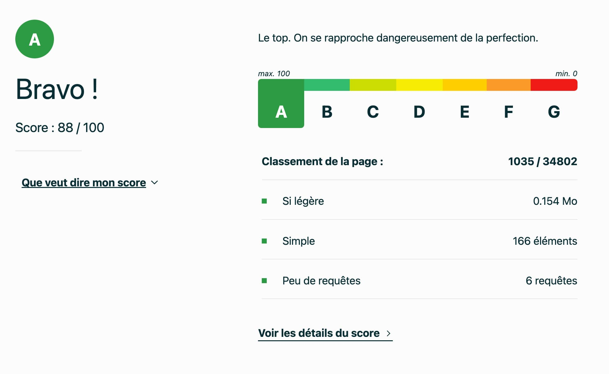

### EcoIndex Site de Tesla

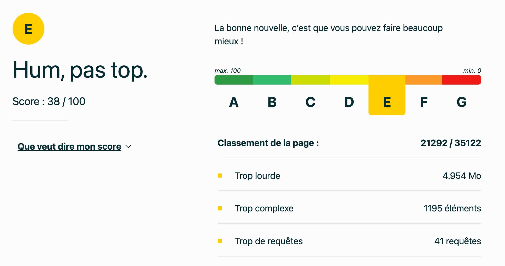

### GTmetrix

[Resultat GTmetrix](https://gtmetrix.com/reports/tesla.birdi.ng/K6IWX6jP/)

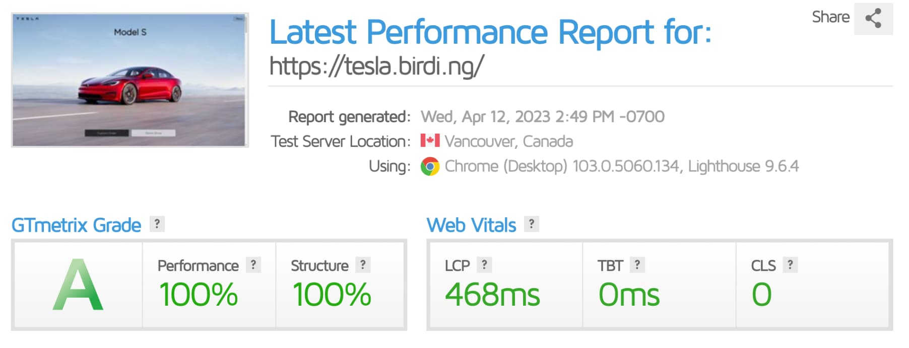

### GTmetrix Site de Tesla

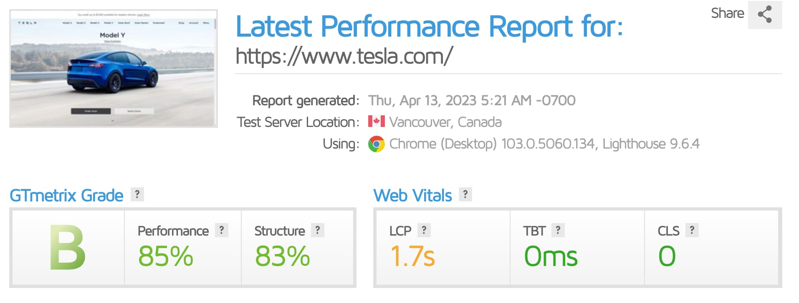

### CarbonIndex

[Resultat CarbonIndex](https://www.websitecarbon.com/website/tesla-birdi-ng/)

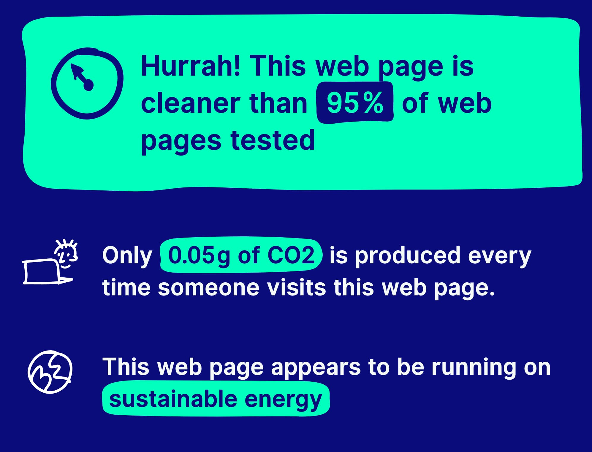

### CarbonIndex Site de Tesla

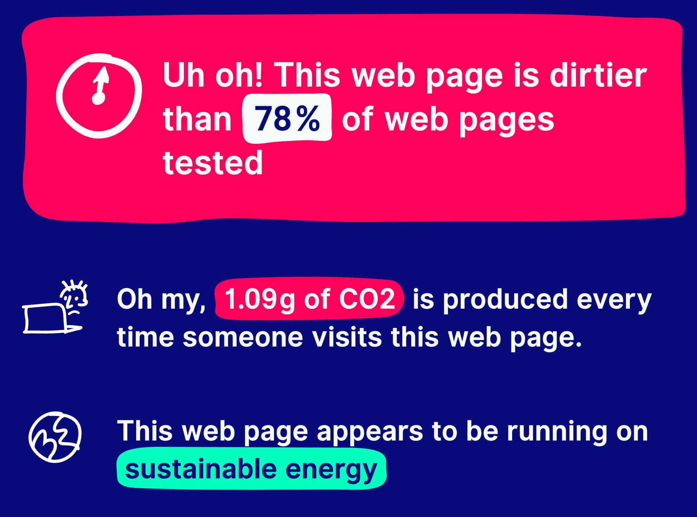
